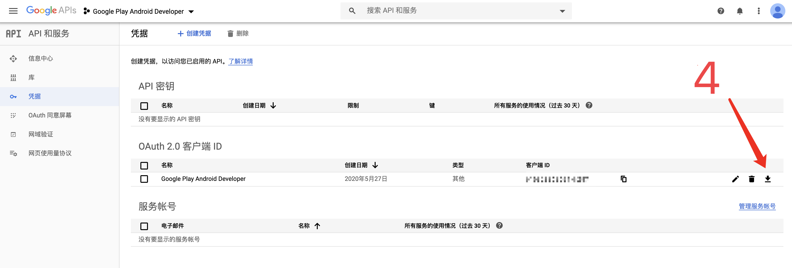
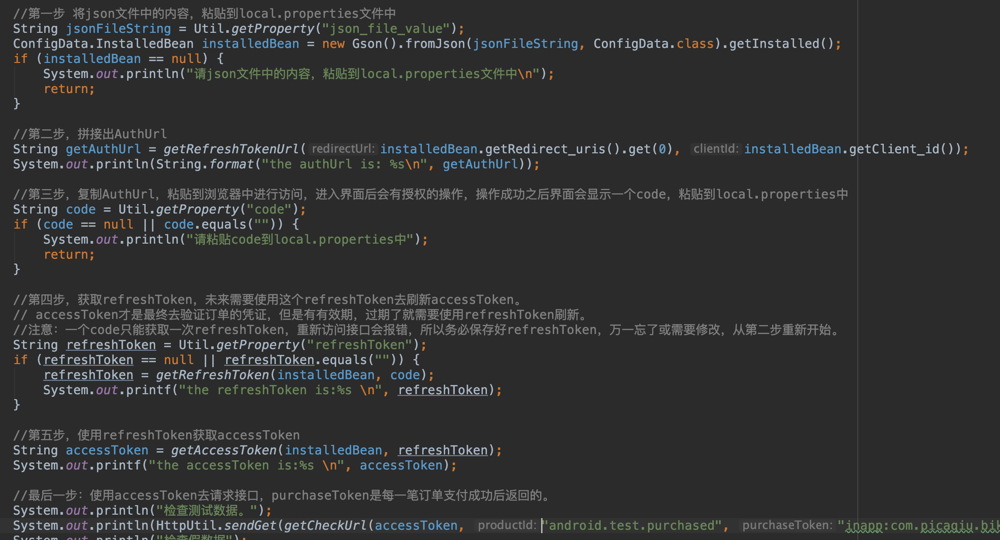
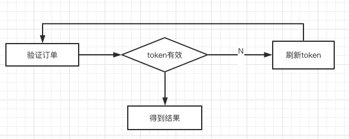

# 接入Google Pay之后，如何验证订单。

##前言

长话短说，接入Google Pay之后，付款成功了，还得验证订单。验证订单这一步，最好放在服务器，有些黑科技可以直接在手机上虚拟一个Google Pay，如果服务器不做验证，很有可能就被刷单了。

在网上借鉴了很多文章，真正有用的似乎很少。官方文档很不友好，可能是国外人思维逻辑不同，导致文档很难看懂，甚至文档找了好久都找不到，不是我菜，后端大佬也是找了好久，都快放弃了o(╥﹏╥)o。借鉴看到的一句话：当前文档不足以支撑开发者接入Google Pay。

## 随笔·坑

- 如果支付发现提示Error checking for billing v3 support这种，不要慌，不是你使用的sdk版本有问题，请检查：当前ip对不对、登陆的google商店账号对不对、商店可能同时保存多个账号，把其他的删除、登陆商店的账号的地区，选的不对也可能导致报这个错，简而言之，就是账号问题。
- 有可能，拉起google支付就挂了，看看是不是小米手机，看看有没有一个“权限管理->后台弹出界面”的选项，勾上它。
- 怎么测试支付？商品id传 android.test.purchased ，就是测试，有可能无法支付，如果你加入了“Google Play 应用签名计划”，那么必须要加入发布到测试版后，才能支付，想清楚了再加入这个计划（好像是不加入这个计划，无法上传bundle包）。
- 怎么发布内测版？在市场提交包后，任何一个内测渠道发包，都需要审核，审核过后才会有一个测试地址。
- 在Google市场下载包，一直在转圈怎么办？可以尝试：切换到美国IP，清空所有应用信息。
- 审核被拒。“商店发布->应用内容”下有选项，目标群体改成18岁以上，应用内容勾上“会无意间吸引儿童”。
- 无法付款怎么半？Google Pay会对账号的地址进行验证，而且还得有信用卡，今年3月份起貌似信用卡都被封了，可怜的我后来向澳大利亚的朋友求助，后来发现可以去某宝买充值卡，美滋滋，测试支付很顺利。

## 步骤

### 一、新建Auth客户端。不要去Google Developers Console中创建，点“创建AUTH客户端就行”。


### 二、点击“在Google Developers Console”中查看，下载对应的json格式的配置文件。




### 三、使用我提供的Java项目进行半自动化操作。

1.**必须创建配置文件： src/main/local.properties**，文件内容如下（package_name和json_file_value此刻应该填写完毕，code和refreshToken在后续步骤中会拿到）

```properties
#填写你的包名
package_name=
#填写你的json文件中的内容
json_file_value=
#填写你访问authUrl后，授权得到的code
code=
#请求授权接口后，获取到的refreshToken
refreshToken=
```

2.按照下图步骤进行操作即可。




### 终

最终成功支付一笔订单后，用purchaseToken在本地测试完后，就OK了。最终提供给你们的后台开发人员就3个值：client_id、client_secret、refresh_token。他们需要做的是：

